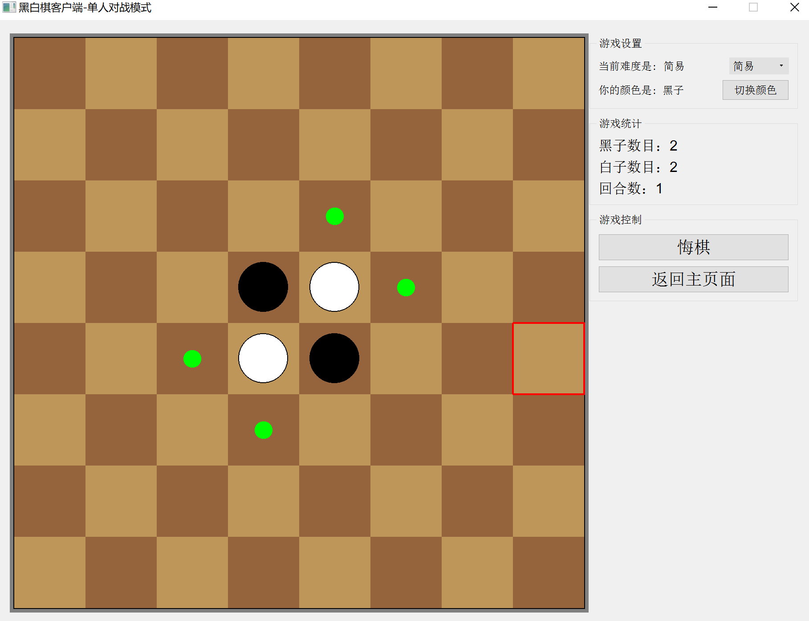
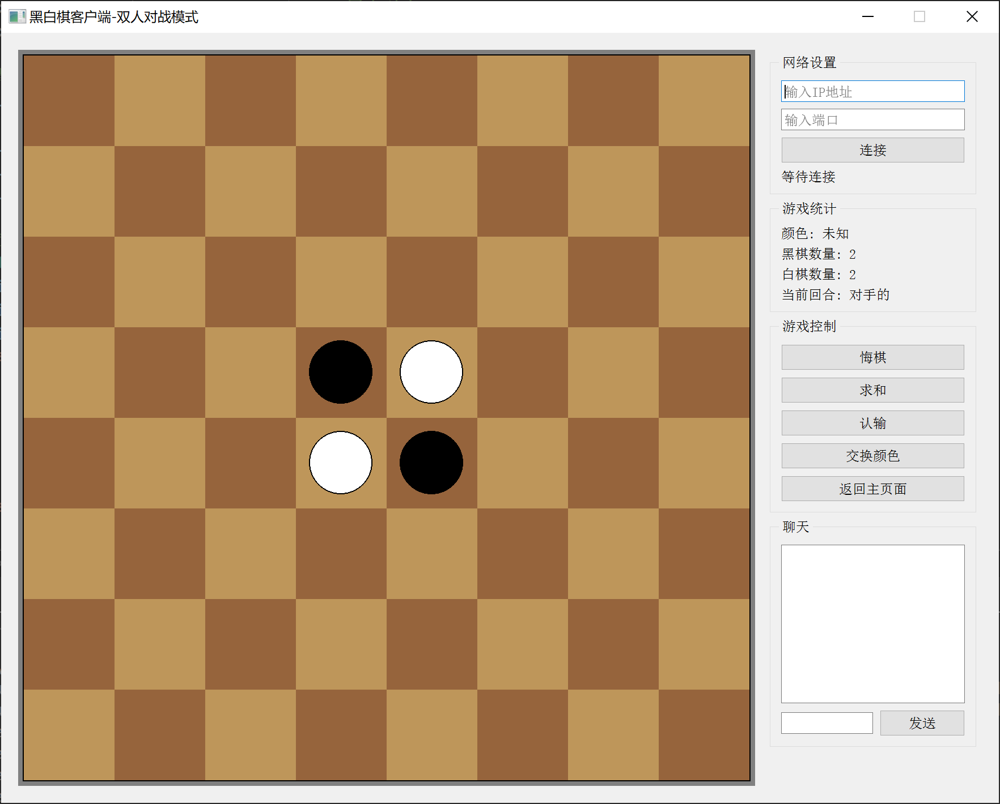
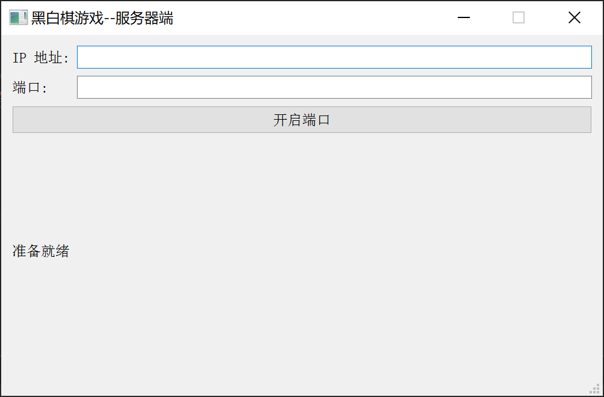

# Reversi 黑白棋游戏

基于Qt 5.9.0的黑白棋游戏设计，支持单人模式和网络对战模式。


## 🎮 项目简介

这是一个功能完整的黑白棋（Reversi/Othello）游戏，提供丰富的游戏体验：

- **单人模式**：与AI对战，支持简易、中等、困难三种难度
- **网络对战模式**：通过局域网或互联网与其他玩家实时对战
- **完整的游戏功能**：悔棋、求和、认输、实时聊天等
- **高分辨率支持**：适配高DPI显示器，提供清晰的游戏界面









## 🌐 网络对战使用指南!


### 服务器端设置

#### 1. 启动服务器
1. 运行编译好的Server可执行文件
2. 在服务器界面中输入以下信息：
   - **IP地址**: 
     - 本机对战: `127.0.0.1` 或 `localhost`
     - 局域网对战: 本机的局域网IP（如 `192.168.1.100`）
     - 公网对战: 公网IP地址
   - **端口**: 推荐使用 `1234`（默认），可选择 1-65535 范围内的任意端口
3. 点击"启动服务器"按钮

#### 2. 服务器状态监控
- 服务器启动成功后，界面会显示"服务器启动成功"消息
- 当有客户端连接时，会显示连接信息
- 最多支持**2个客户端**同时连接进行对战

### 客户端连接

#### 1. 进入网络对战模式
1. 运行客户端程序
2. 在主界面点击"**双人对战**"按钮
3. 进入网络对战界面

#### 2. 连接服务器
在网络对战界面的右侧"网络设置"区域：
1. **输入IP地址**: 输入服务器的IP地址
   ```
   本机测试: 127.0.0.1
   局域网: 192.168.1.x (服务器的局域网IP)
   公网: xxx.xxx.xxx.xxx (服务器的公网IP)
   ```
2. **输入端口**: 输入服务器使用的端口号（默认：1234）
3. **点击连接**: 连接状态会在下方显示

#### 3. 开始游戏
- **第一个连接的玩家**：自动分配**黑色**棋子，先手
- **第二个连接的玩家**：自动分配**白色**棋子，后手
- 连接成功后，游戏自动开始

## 🎯 游戏功能详解

### 基本对战功能
- **实时对战**: 棋步即时同步，无延迟体验
- **回合提示**: 清晰显示当前轮到哪位玩家
- **棋子统计**: 实时显示黑白棋子数量
- **合法落子提示**: 自动高亮可落子位置

### 高级功能
- **悔棋功能**: 
  - 点击悔棋按钮向对手发送请求
  - 对手可以同意或拒绝悔棋
- **求和功能**: 
  - 提议平局，需要对手同意
- **认输功能**: 
  - 直接认输，游戏立即结束
- **实时聊天**: 
  - 对战过程中可以发送文字消息
  - 支持实时交流

### AI对战模式
在单人模式中，可选择三种AI难度：
- **简易**: 随机或简单策略
- **中等**: 考虑基本策略
- **困难**: 高级AI算法

## 🔧 网络配置指南

### 局域网对战设置
1. **确保设备在同一网络**: 所有设备连接到相同的WiFi或有线网络
2. **获取服务器IP**: 
   ```bash
   # Windows
   ipconfig
   
   # macOS/Linux
   ifconfig
   ```
3. **关闭防火墙**: 或在防火墙中允许程序通过
4. **端口转发**: 如果需要，在路由器中设置端口转发

### 公网对战设置
1. **公网IP**: 服务器需要有公网IP或使用内网穿透工具
2. **端口映射**: 在路由器中将游戏端口映射到服务器内网IP
3. **防火墙配置**: 确保服务器防火墙允许指定端口的TCP连接

### 常用端口建议
- **默认端口**: 1234（推荐）
- **备用端口**: 8080, 9999, 12345
- **避免使用**: 80, 443, 22, 21等系统保留端口

## 🐛 故障排除

### 连接问题
**问题**: 客户端无法连接到服务器
**解决方案**:
1. 检查IP地址是否正确
2. 确认服务器已启动且端口正确
3. 检查防火墙设置
4. 验证网络连通性（ping测试）

**问题**: 连接成功但游戏无法开始
**解决方案**:
1. 确保有且仅有2个客户端连接
2. 重启服务器和客户端
3. 检查网络稳定性

### 游戏问题
**问题**: 棋步不同步
**解决方案**:
1. 检查网络连接稳定性
2. 重新连接服务器
3. 确保客户端版本一致

**问题**: 聊天消息不显示
**解决方案**:
1. 检查聊天输入框是否有内容
2. 确认网络连接正常
3. 尝试重新发送消息

## 📋 游戏规则

### 黑白棋基本规则
1. **棋盘**: 8x8格子，开局时中央4格放置2黑2白
2. **轮流下棋**: 黑方先手，双方轮流落子
3. **合法落子**: 新落的棋子必须能夹住对方的棋子
4. **翻转棋子**: 被夹住的对方棋子全部翻转为己方颜色
5. **游戏结束**: 棋盘下满或双方都无法落子时游戏结束
6. **胜负判定**: 己方棋子数量多的一方获胜

### 特殊情况
- **无法落子**: 如果一方无合法落子位置，则跳过该方回合
- **双方无法落子**: 游戏提前结束，按当前棋子数量判定胜负
- **棋子数量相等**: 平局

---

**享受您的黑白棋对战之旅！** 🎲

